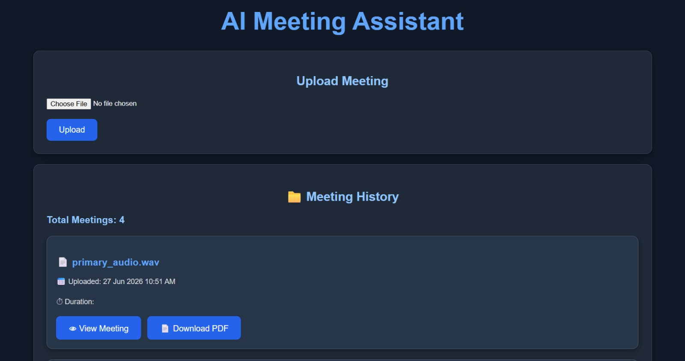

# AI Meeting Assistant

> A full-stack AI Meeting Assistant that transcribes meetings, performs
> speaker diarization, generates AI summaries, stores meeting history in
> PostgreSQL, and enables speaker-aware chat using an LLM.

> **Home Page Screenshot**\



------------------------------------------------------------------------

# Features

-   Upload audio meetings
-   Whisper speech-to-text transcription
-   Speaker diarization using PyAnnote
-   AI meeting summaries using Groq Llama 3.3
-   Speaker-aware AI chat
-   Meeting history
-   PDF generation
-   PostgreSQL integration
-   React + FastAPI architecture

------------------------------------------------------------------------

# Tech Stack

  Category   Technologies
  ---------- -----------------------------------
- Frontend   React, Axios, CSS
- Backend    FastAPI, SQLAlchemy
- Database   PostgreSQL
- AI         Whisper, PyAnnote, Groq Llama 3.3
-Other      Google Colab, ngrok, Hugging Face

------------------------------------------------------------------------

# Project Structure

``` text
AI_MEETING_ASSISTANT
│
├── backend
│   ├── services
│   ├── uploads
│   ├── pdfs
│   ├── database.py
│   ├── models.py
│   ├── main.py
│   ├── config.py
│   └── speaker_api.py
│
├── frontend
│   ├── src
│   ├── public
│   └── package.json
│
├── notebooks
│   └── speaker_diarization_api.ipynb
│
├── assets
├── README.md
└── .gitignore
```

## Folder Description

### backend/

Contains the FastAPI backend, REST APIs, database integration and AI
pipeline.

### backend/services/

-   `transcription.py` -- Whisper transcription.
-   `summarizer.py` -- Groq meeting summary.
-   `speaker_api.py` -- Connects to the Google Colab speaker diarization
    API.
-   `pdf_generator.py` -- Generates downloadable meeting PDFs.
-    `rag.py` -- To chat with the database.

### backend/uploads/

Temporary storage for uploaded meeting audio.

### backend/pdfs/

Stores generated PDF reports.

### frontend/

React application for uploading meetings, viewing transcripts,
summaries, speaker transcripts and chatting with meetings.

### notebooks/

Contains the Google Colab notebook implementing the speaker diarization
microservice.

### assets/

Stores screenshots used in this README.

------------------------------------------------------------------------

# How It Works

1.  User uploads an audio meeting.
2.  FastAPI stores the uploaded file.
3.  Whisper generates the transcript.
4.  Audio is sent to the Google Colab Speaker Diarization API.
5.  PyAnnote identifies speakers and Whisper transcribes each speaker
    segment.
6.  Groq generates the meeting summary.
7.  Transcript, speaker transcript and summary are stored in PostgreSQL.
8.  React displays transcripts, summaries, speaker transcripts and AI
    chat.

------------------------------------------------------------------------

# Prerequisites

-   Python 3.11+
-   Node.js
-   PostgreSQL
-   Git
-   Hugging Face account
-   Groq API Key
-   ngrok account
-   Google Colab

------------------------------------------------------------------------

# Setup

## Clone Repository

``` bash
git clone https://github.com/<YOUR_USERNAME>/AI_MEETING_ASSISTANT.git
cd AI_MEETING_ASSISTANT
```

## Backend

``` bash
cd backend
python -m venv venv
```

Activate the virtual environment.

**Windows**

``` bash
venv\Scripts\activate
```

Install dependencies.

``` bash
pip install -r requirements.txt
```

Create a `.env` file inside `backend`.

``` env
DATABASE_URL=your_database_url
GROQ_API_KEY=your_groq_api_key
```

Create these folders if they do not already exist.

``` text
backend/
├── uploads/
└── pdfs/
```

Create a PostgreSQL database (for example `meeting_assistant`) and
update `DATABASE_URL`.

------------------------------------------------------------------------

## Speaker Diarization Service

Open:

``` text
notebooks/speaker_diarization_api.ipynb
```

Run all notebook cells.

After the notebook starts:

-   Copy the generated ngrok URL.
-   Update the URL in:

``` text
backend/services/speaker_api.py
```

Restart the backend after updating the URL.

------------------------------------------------------------------------

## Start Backend

``` bash
cd backend
uvicorn main:app --reload
```

Backend:

``` text
http://127.0.0.1:8000
```

------------------------------------------------------------------------

## Start Frontend

``` bash
cd frontend
npm install
npm run dev
```

Frontend:

``` text
http://localhost:5173
```

------------------------------------------------------------------------

# Using the Application

1.  Start the Google Colab speaker diarization service.
2.  Start the FastAPI backend.
3.  Start the React frontend.
4.  Upload an audio meeting.
5.  Wait for transcription, speaker diarization and summary generation.
6.  View transcript, summary and speaker transcript.
7.  Chat with the meeting.
8.  Download the meeting PDF.

------------------------------------------------------------------------

# Future Improvements

-   Named speaker recognition
-   Authentication
-   Real-time meeting transcription
-   Cloud deployment
-   Multi-language support

------------------------------------------------------------------------

# Author

**Abhinaya Pinreddy**

GitHub: https://github.com/AbhinayaPinreddy
